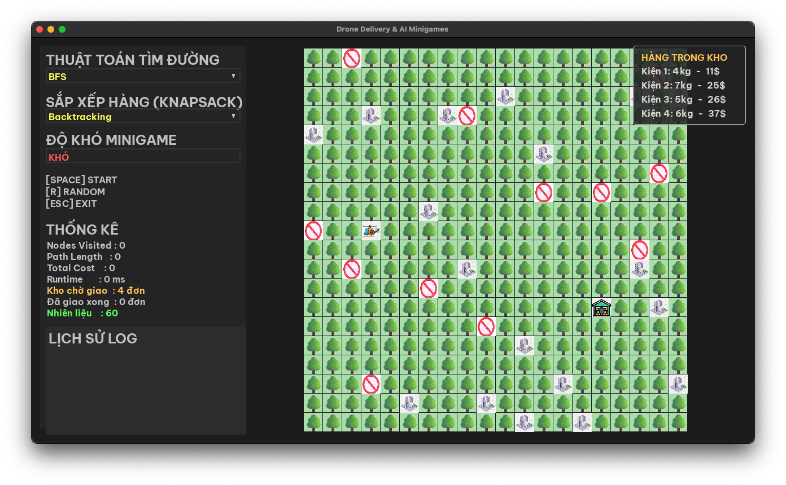
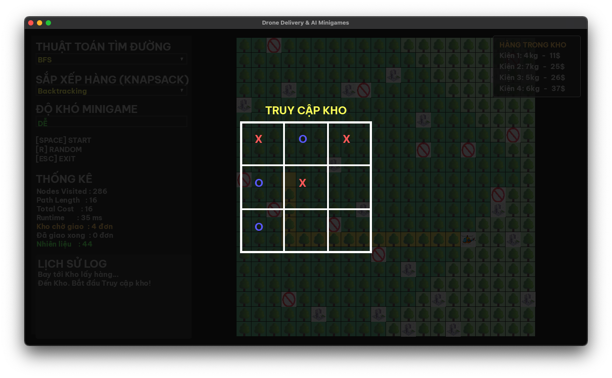
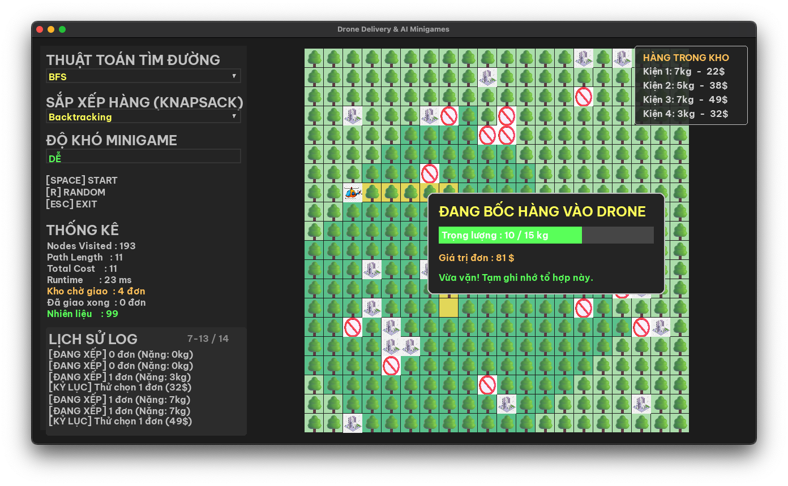
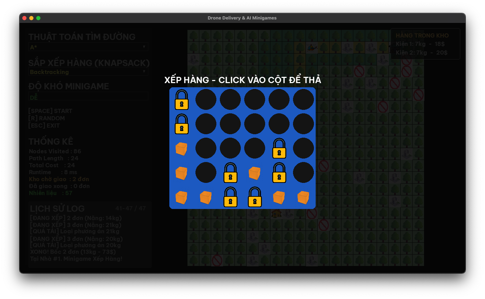

# <center>Shipper Delivery Game</center>

<h4 align="center">Final Project of Artificial Intelligence Subject - 252ARIN330585_06<br>Ho Chi Minh City University of Technology and Engineering (HCMUTE)</h4>

<p align="center">
  
  
  
</p>

## Table of Contents

<details open>
  <summary><b>Quick Access</b></summary>
  <br>

> *  [Member](#member)
> *  [Demo](#demo)
> *  [Algorithms](#algorithms)
> *  [Features](#features)
> *  [Requirements](#requirements)
> *  [Project Structure](#project-structure)
> *  [Installation](#installation)
> *  [Running](#running)
> *  [Controls](#controls)
> *  [Picture](#picture)
> *  [Conclusion](#conclusion)
> *  [License](#license)

</details>
<hr>

## Member

***Group 10***

|Name|Student ID|Github|
|:---:|:---:|:---:|
|Nguyễn Đình Khanh|24110244|[@qilskcter](https://github.com/qilskcter)|
|Nguyễn Trần Anh Quốc|24110314|[@anhquoc11](https://github.com/anhquoc11)|

## Demo

NHET GIF VO DAY 

## Algorithms

**1. Uninformed Search**

-  [BFS](./algorithms/BFS.py)
-  [DFS](./algorithms/DFS.py)

**2. Informed Search**

-  [Greedy](./algorithms/greedy.py)
-  [A*](./algorithms/A_sao.py)

**3. Local Search**

-  [Simple Hill Climbing](./algorithms/Simple_Hill_Climbing.py)
-  [Local Beam Search](./algorithms/Local_Beam_Search.py)

**4. Search in Complex Environments**

-  [TBD]()
-  [TBD]()

**5. Constraint Satisfaction Problem (CSP)**

-  [BackTracking](./algorithms/backtracking.py)
-  [Forward-Checking](./algorithms/forward_checking.py)

**6. Adversarial Search**

-  [Minimax](./algorithms/minimax.py)
-  [Alpha - Beta](./algorithms/alpha_beta.py)

## Features

-  **Dynamic Map Generation:** Randomly generated environments with obstacles, delivery points, and a warehouse.
-  **Pathfinding Visualizer:** Watch various search algorithms (A*, BFS, DFS) calculate optimal routes in real-time.
-  **Knapsack Optimization:** Utilizes Backtracking and Forward Checking to intelligently pack the drone for maximum profit.
-  **Adversarial Minigames:** Compete against an AI using Minimax and Alpha-Beta pruning in Tic-Tac-Toe and Connect 4 to win fuel and cargo capacity.

## Requirements

-  Python 3.7+
-  Pygame


## Project Structure

```
Shipper-Delivery-Game
├── Assets                           # Contains all game graphics and fonts
│   ├── Building.jpg
│   ├── Drone.jpg
│   ├── Nofly.jpg
│   ├── Tree.png
│   ├── Warehouse.jpg
│   ├── box.png
│   ├── fonts
│   │   └── font.ttf                 # Custom font file
│   ├── house.jpg
│   └── lock.png
├── README.md
├── algorithms                       # Contains all AI algorithm modules
│   ├── A_sao.py
│   ├── BFS.py
│   ├── DFS.py
│   ├── Local_Beam_Search.py
│   ├── Simple_Hill_Climbing.py
│   ├── Utility.py
│   ├── alpha_beta.py
│   ├── backtracking.py
│   ├── forward_checking.py
│   ├── greedy.py
│   └── minimax.py
└── pygame_app.py                    # The main execution script
```

## Installation

Follow these steps to set up and run the project on your local machine:

**Step 1: Clone or Download the Project**
-  Extract the downloaded project .zip file into your desired directory, or clone the repository if you are using Git.

**Step 2: Install Required Libraries**
-  Open your terminal (Command Prompt/PowerShell on Windows, or Terminal on macOS/Linux) and navigate to the project directory. Install pygame using pip:

***For Windows:***

```Bash
pip install pygame
```

***For macOS / Linux:***

```Bash
pip3 install pygame
```

## Running

Once the dependencies are installed and the folder structure is correct, you can start the game by running the main script in your terminal:

**For Windows:**

```Bash
python pygame_app.py
```

**For macOS / Linux:**

```Bash
python3 pygame_app.py
```

## Controls

-  **[SPACE]:** Start the delivery process / Execute the selected AI algorithm.

-  **[R]:** Randomize the map (generate a new map with random obstacles, houses, and warehouse positions).

-  **[ESC]:** Exit the game.

-  **Mouse Left Click:** Interact with the dropdown menus (Pathfinding, Knapsack, Difficulty) and play the minigames (Tic-Tac-Toe & Connect 4).

-  **Mouse Scroll Wheel:** Scroll through the dropdown menus and the Log History panel.

## Picture

<table align="center">
  <tr>
    <td></td>
    <td></td>
  </tr>
  <tr>
    <td></td>
    <td></td>
  </tr>
</table>

## Conclusion

This final project successfully bridges the gap between theoretical Artificial Intelligence concepts and practical, visual application. By simulating a real-world delivery system, the project demonstrates how different AI algorithms can seamlessly work together to solve complex, multi-layered problems.

Specifically, the project highlights three major domains of AI:

-  **Pathfinding & Search Algorithms:** Utilizing algorithms like A*, BFS, DFS, and Greedy to navigate dynamic environments, avoid obstacles, and find the most efficient routes.

-  **Adversarial Search:** Implementing Minimax and Alpha-Beta Pruning to create a challenging and interactive experience in zero-sum minigames (Tic-Tac-Toe and Connect 4) against the user.

-  **Constraint Satisfaction & Optimization:** Applying Backtracking and Forward Checking to solve the Knapsack problem, allowing the AI to optimize cargo weight and maximize delivery profits under strict capacity constraints.

Ultimately, this project not only serves as a comprehensive review of fundamental AI algorithms but also provides a highly interactive and engaging graphical interface. It proves that AI is not just about abstract mathematics and data, but a powerful tool for making optimal decisions in everyday scenarios.

## License

Distributed under the MIT License. See [`LICENSE`](./LICENCE) for more information.